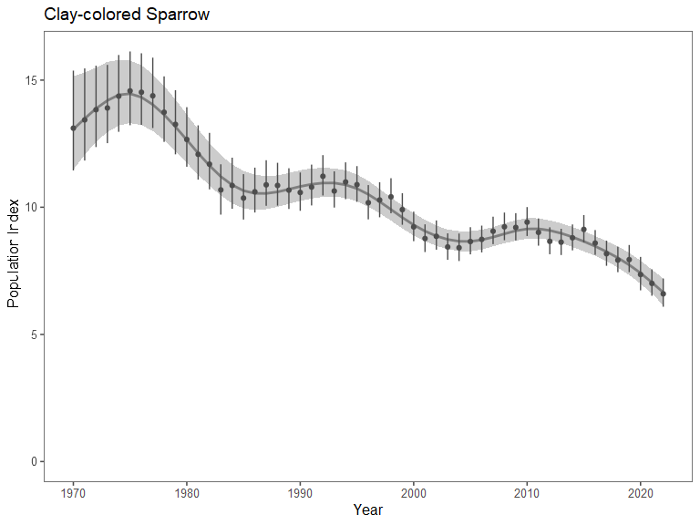
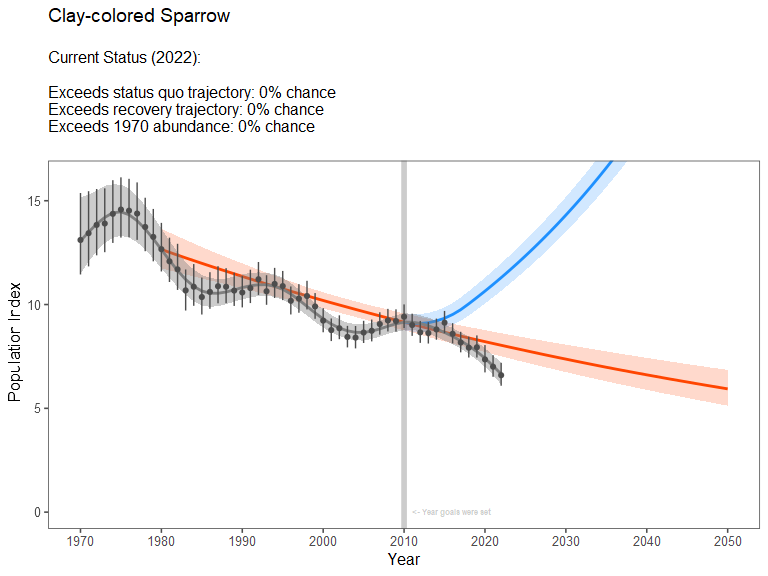
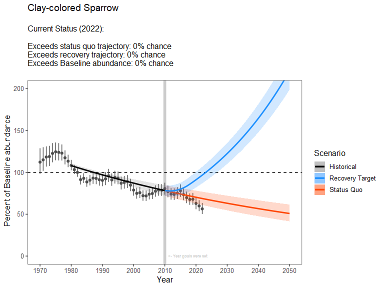

# Overview

This document outlines a proposed approach for setting interim
population goals for declining species. We seek to develop **SMART**
interim population goals:

-   ***S**pecific*: What needs to be accomplished? Who is responsible
    for it? What steps need to be taken to achieve it?

-   ***M**easurable*: Goals are stated in quantitative terms and based
    on indicators that are tracked through routine monitoring.

-   ***A**chievable*: Goals represent population recovery scenarios that
    would occur through sustained but incremental investment in
    conservation. The goals also recognize that fully recovering species
    that have experienced long-term declines is unrealistic in many
    cases.

-   ***R**elevant*: How do these goals relate to CWS/ECCC/GOC mandates?

-   ***T**ime-bound*: The time horizon represents the scale at which
    conservation action has the potential to achieve goals.

For each species that has experienced long-term population declines, we
construct two projection curves that represent alternative future
pathways populations could take:

1.  population declines continue at the same mean annual rate as in the
    past, or

2.  populations achieve a specified target population growth at a
    specified point in the future, resulting in a “recovery curve”

As new monitoring data is collected in the future, progress towards
recovery can be measured by compared the observed population trajectory
to the projections.

# Method description & case study

### Historical trajectory and population trend

We start by fitting a population model to monitoring data for a focal
species. We accomplish this using the `bbsBayes2` R package for species
monitored by the North American Breeding Bird Survey. We fit the ‘gamye’
version of the model, which uses hierarchical splines to model
curvilinear population trajectories, as well as random annual year
effects.

The code below fits the model for **Clay-colored Sparrow**:

``` r

# Focal species
species_name <- "Clay-colored Sparrow"

# Species names and abbreviations (avian core 2022)
ac <- read_xlsx("data/1_Avian_Core_20220422_FULLVERSION.xlsx")

# 4 letter species abbreviation code
sp_code <- subset(ac, English_Name == species_name)$Species_ID

# Directory where fitted model will be stored 
filename <- paste0("fitted_models/",sp_code,".RDS")

# Fit model for this species, save resulting indices
if (!file.exists(filename)){
  
  # Stratify data
  s <- stratify(by = "bbs_usgs", species = species_name)
  
  p <- tryCatch(expr = {prepare_data(s)},
                error = function(e){NULL})
  
  # Fit model & generate indices
  if (is.null(p)) next
  p <- prepare_data(s)
  md <- prepare_model(p, model = "gamye")
  m <- run_model(md, save_model = FALSE)
  i <- generate_indices(model_output = m, regions = "country")
  
  # National indices
  samps <- i$samples$country_Canada
  
  # Save results
  sp_results <- list(samps = samps)
  saveRDS(sp_results, file = filename)
}
```

Below, we plot the annual population indices for the species:



### Population projections

For each species, we construct projections of hypothetical trajectories
that represent optimistic but potentially achievable scenarios of
population recovery. The projections begin with the **current** rate of
long-term population decline (estimated from empirical data), achieve a
**target** population growth rate after a defined number of years (based
on assumptions about hypothetical rates of conservation action), and
potentially continue that trajectory until the population reaches full
recovery.

Projections are distinct from forecasts, and we are **not making
empirical predictions** about the future state a population will
achieve. Rather, we are describing a path towards recovery that is
potentially achievable if conservation action is pursued. Uncertainty in
these projections is entirely driven by uncertainty about the size of
the population in the year the goals were set, and the rate of decline
of the species. Projections do not include uncertainty related to the
deployment or efficacy of future conservation action. We are describing
scenarios in form of: *IF* conservation action results in a particular
pattern of change in population growth rates, *THEN* we expect
populations to recover at a particular rate.

Population projections require several key inputs:

1.  **Historical trend**: An estimate of historical population trend,
    which describes the average rate of population change populations
    have experienced over the ‘long-term’. This is calculated directly
    from the population indices that are generated from Bayesian
    analysis of the dataset. By default, we calculate the mean rate of
    annual population change between 1980 and 2022, recognizing that
    indices prior to 1980 are often highly uncertain and may be
    unreliable.

2.  **Year in which goals are set**: This is the date at which the
    projection ‘begins’. After this date, progress towards recovery will
    be evaluated. In these projections, we set goals in 2022. However,
    to illustrate the way in which these projections would be used, we
    can create hypothetical scenarios in which goals would have been set
    in 2010, and progress was subsequently monitored.

3.  **Target population trend**: We set a goal of achieving annual
    population growth rates of **+3% per year** at a specific year in
    the future (see below). This is within the range of biologically
    possible growth rates for all species considered, and is also within
    the range of observed growth rates for species that have experienced
    long-term population increases.

4.  **Years until target growth rate is achieved**: This relates to the
    speed at which conservation action is expected to occur, under an
    optimistic conservation scenario. By default, we set a goal of
    increasing annual growth rates by +0.5% per year, until the target
    growth rate (+3% per year) is achieved. For species with highly
    negative current growth rates, it will therefore take longer to
    reach the +3% growth rate target.

Below, we illustrate a population projection for Clay-colored Sparrow.
For illustrative purposes, we imagine that in 2010 a goal was set to
increase population growth rate by +0.5% per year, until a growth rate
of +3% per year was achieved. We plot the resulting “recovery
projection”, and track progress towards that goal by comparing the
empirical population indices (from 2011 to 2022) against the projection.

The code below accomplishes this projection, using a custom R function
called `projection_function`:

``` r

CCSP_projection <- projection_function(CCSP_results,
                                       
                                       # Years for calculating baseline index for 'full recovery' (average across these years)
                                       baseline_years = c(1980,1981,1982,1983,1984),    
                                       
                                       # How far back to calculate "current" trend over)
                                       length_current_trend = 30, # 30 year trend
                                       
                                       # Year in which goals were set
                                       year_goals_are_set = 2010,
                                       
                                       # Percent change per year once population reaches its target growth rate
                                       target_trend = 3,    
                                       
                                       # Years until target growth rate is reached, starting in the year goals are set
                                       years_to_target_trend = 25,
                                       
                                       # Final year of projection
                                       end_of_projection = 2050
)
```



The **blue** curve represents the recovery scenario.

The **red** curve represents a population that continues to decline at
the mean long-term rate observed for the population.

The **gray** curve is the trajectory the population has actually taken.

All of the data and projection curves could be expressed *relative* to a
historical baseline population index. In this case, we use the mean
population index from 1980-1984 as a baseline abundance which would
represent “full recovery” of the species. Nothing has changed in terms
of the model inputs, assumptions, or outputs; this is just a different
way of graphically visualizing the projections.

The plot below illustrates this alternative way of visualizing the
projections:



This framework illustrates several key messages:

1.  Currently, the national population of Clay-colored Sparrow is almost
    certainly below the recovery target that was set for it as of 2010
    (\>99.9% chance). Moreover, the current population estimate is
    currently even lower than if the population had continued to decline
    at its long-term rate. This implies that since 2010, the population
    has declined more rapidly than its long-term mean rate of change.

2.  If recovery targets are met, in the year 2050 the population would
    be 157.8% of its baseline abundance (95% CRI = 140.2 to 176.4%).

3.  blah

4.  blah

# Application to all species

We applied the framework to \_\_\_\_\_ species that are estimated to
have experienced long-term population declines and are considered to be
well-monitored by the Breeding Bird Survey. For each species, we set
population goals starting in 2022 (the most recent year of BBS
estimates).

This involved:

1.  Fitting Bayesian hierarchical models for each species, to estimate
    population trajectories and historical trends
2.  Conducting projections of population recovery, assuming population
    growth rates would be increased by 0.5% per year until a target
    growth rate of +3% per year was achieved (after which, the
    projection continued growing at a rate of +3% per year)
3.  Reporting the population status in 2050 (i.e., under the
    hypothetical scenario where the population grew according to the
    projection)
4.  Reporting the year in which ‘full recovery’ would be achieved (i.e.,
    under the hypothetical scenario where the population grew according
    to the projection)

Code to accomplish this is included below:

# Results summary

# Extensions

This framework can be applied to species that are monitored by other
programs than the BBS (e.g., for species better-monitored by the
Christmas Bird Count, migration monitoring, targeted surveys, etc). To
fully propagate uncertainty in projections, the framework requires a
time series of population estimates with uncertainty represented by a
collection of samples from a joint Bayesian posterior. For species that
are not modeled using Bayesian methods, bootstrapping can be used to
construct a collection of population time series (which represent
uncertainty in the empirical estimates of how populations have changed
over time).

## Citations

R Core Team (2021). R: A language and environment for statistical
computing. R Foundation for Statistical Computing, Vienna, Austria.
